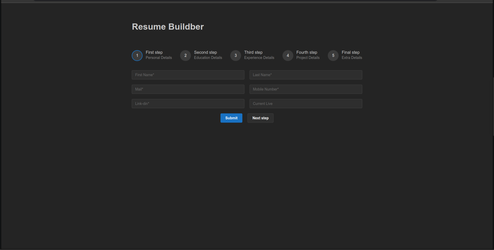
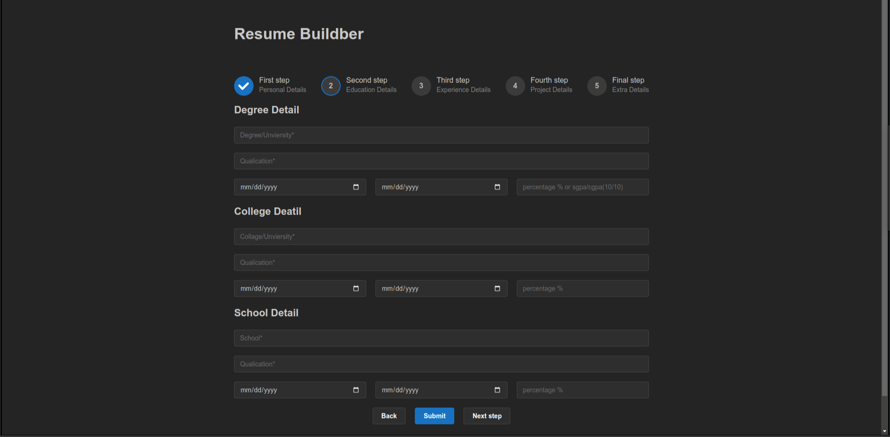
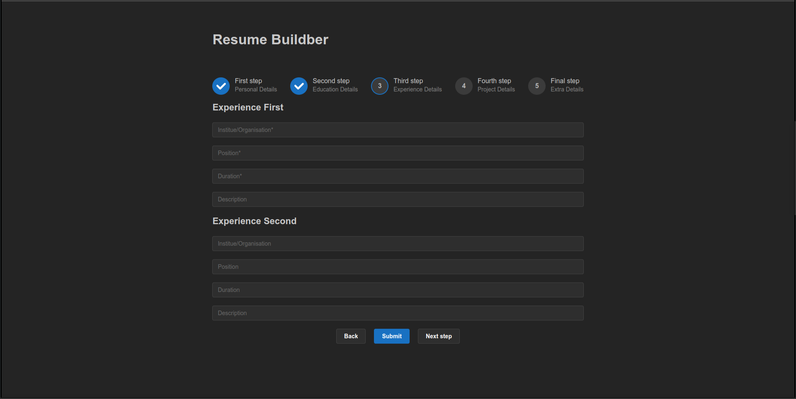
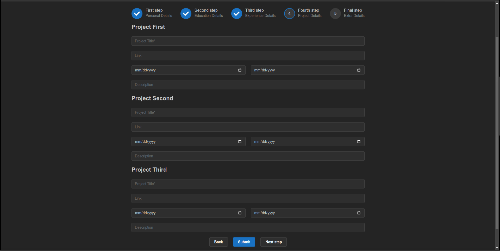
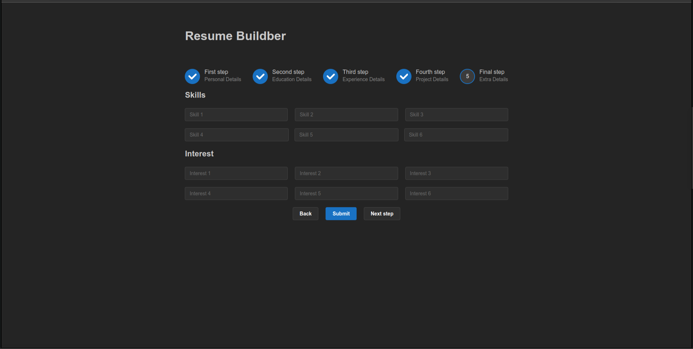
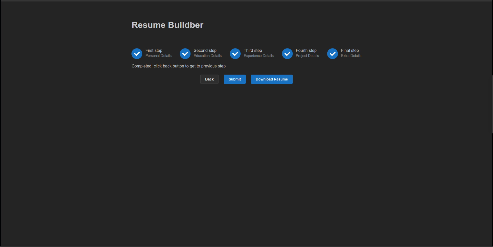

# Resume Builder

This app is designed to help you create a professional CV.

### Tech used -

1. `React js`
2. `Mantine UI`
3. `Jspdf`

### Hosted url -

https://resume-builder-gkb.vercel.app/

### Use - Create process

#### First From

Open Resume builder App put first name and other details. Click → Submit

#### Second From

Than put Educations Details . Click → Submit

#### Third From

You are complete any internship or job put here .Click → Submit

#### Four From

Put here you are create projects and some details .Click → Submit

#### Five From

And put here Extra details like skills and hobbies .Click → Submit

#### Last Setp

Last setp show Three buttons first put details than .Click → Submit
And Download Resmue buuton Click .

